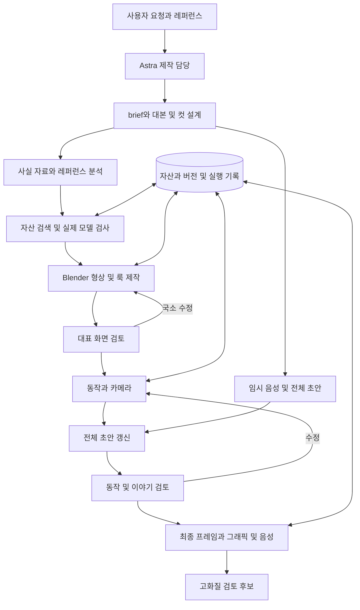

# Astra Blender 릴스 제작 에이전트 빌드 계획

작성일: 2026-10-01. 최종 검토: 2026-10-02. 상태: v1 구현됨(2026-10-02), 2026-10-04 route·look·camera rig·자산 팩토리·생성 클립 추가. 실제 능력은 BUILD_REPORT.md가 우선한다. 대상: 이 문서만으로 다음 구현 세션을 시작할 개발 에이전트와 사용자.

목표는 사용자가 자연어와 레퍼런스로 장면 또는 릴스 제작을 지시하면, Astra가 자료·자산을 확보하고 Blender 장면을 제작·검토·수정한 뒤 음성·설명 그래픽과 함께 거의 완성된 릴스를 내보내는 것이다. 기존 장면의 수정과 재촬영은 새 모델 제작보다 빠르게 수행하도록 설계한다. 임의의 실물을 처음부터 즉시 정확하게 재현하는 기능을 약속하지 않는다.

이 문서는 기능, 모듈, 파일 계약, 명령, 상태 전이, 실패 처리, 빌드 순서와 인수 기준을 정의한다. 여기의 새 명령·모듈·JSON은 구현할 규격이다. 현재 동작하는 기능으로 오해하지 않는다. 구현 결과의 시각 품질과 실행시간은 별도 검증한다.

## 1 제품 범위와 결정

### 1.1 사용자에게 제공할 기능

| ID | 기능 | 사용자 입력 | 성공 결과 |
| --- | --- | --- | --- |
| F01 | 새 장면 | 대상, 보여줄 사건, 참고 화면 | 편집 가능한 장면, 대표 프레임, 동작 프리뷰 |
| F02 | 새 릴스 | 주제, 메시지, 길이, 스타일 | 대본, 전체 초안, 고화질 검토 후보, 원본과 출처 |
| F03 | 부분 수정 | 기준 버전, 바꿀 것, 유지할 것 | 해당 부분만 수정한 새 버전, 변경 비교 |
| F04 | 자산 확보 | 필요한 대상과 부품, 촬영 거리 | 보유/외부 후보, 실제 모델 검사, 적합한 자산 또는 대체 제작안 |
| F05 | 디테일 제작 | 실루엣, 근접 부품, 표면 기준 | 모델·재질·빛이 레퍼런스 기준에 맞도록 개선된 장면 |
| F06 | 움직임과 촬영 | 분리·단면·흐름·접근 지시 | 요청한 동작 및 카메라 애니메이션 |
| F07 | 설명 그래픽 | 표시 대상, 문구, 표시 구간 | 부품에 연결된 안내선, 라벨, 자막 |
| F08 | 음성 및 편집 | 한국어 대사, 음성 설정 | 타이밍이 맞는 내레이션, 컷 편집, 음향 |
| F09 | 자동 검토와 개선 | 레퍼런스, 평가 기준, 작업 한도 | 근거 프레임이 있는 평가, 제한된 반복 수정 |
| F10 | 재개 및 재사용 | 프로젝트/컷/실행 ID | 중단 지점부터 재개, 이전 자산·연출 재사용 |
| F11 | 한 번의 요청으로 진행 | 주제 또는 제작 brief | 내부 작업을 자율 진행하고 후보 또는 구체적 병목 반환 |

한 번의 요청은 한 번의 모델 응답이라는 뜻이 아니다. 내부에서 검색, 코드 작성, 미리보기와 수정을 반복한다. 모든 작업은 사람이 매번 승인하지 않아도 정해진 범위 안에서 진행한다. 최종 게시와 유료 구매는 별도 행위로 남긴다.

### 1.2 첫 버전의 고정 선택

- 인터페이스: 현재 사용 중인 Codex/ChatGPT Work의 로컬 작업 가능한 대화 환경.
- 제작 담당: 계정에서 사용 가능한 `gpt-6-astra`를 명시적으로 선택. 현재 대화 모델을 Astra라고 추정하지 않는다.
- 에이전트 지침: 저장소의 `.agents/skills/reel-production/SKILL.md`. 루트 지침은 짧게 유지하고 본 설계 및 도구 도움말을 참조한다.
- 실행 도구: Python CLI와 Blender Python. 별도 웹앱·API 서버·벡터 DB·워크플로 프레임워크를 만들지 않는다.
- 기본 Blender 연결: 실행 파일에 `--background --python`을 전달. 원본 `.blend`를 불러와 필요한 부분만 수정한다. CLI 실행이 매번 전체 재생성을 의미하지 않는다.
- MCP: 첫 버전의 필수 의존성이 아니다. 사용자가 열린 Blender 화면에서 직접 함께 편집해야 할 때 추가한다.
- 기본 출력: 세로 1080×1920, 30fps, SDR, 한국어. 첫 버전 릴스 길이 15~60초, 컷 3~8개. 단일 컷 요청은 2~12초. 이는 제품 기본 범위이며 Instagram 규정의 주장이나 영구 제한이 아니다.
- 장면 자산: 로컬 라이브러리 우선, Poly Haven 자동 검색/다운로드, 외부에서 확보한 허용된 파일 가져오기. 특정 실물 자산은 웹 검색으로 후보를 조사하되 구매·로그인 다운로드를 자동화하지 않는다.
- 내레이션: 키 없는 초안은 macOS `say`의 한국어 음성. 최종 음성은 설정된 ElevenLabs 계정의 `eleven_multilingual_v2`, 사용자 제공 녹음도 수용한다.
- 편집: FFmpeg + Pillow. 현재 FFmpeg에 `subtitles`/`ass` 필터가 없으므로 ASS/libass를 기본 의존성으로 두지 않는다.
- 검수: 규칙 기반 검사와 Astra의 이미지 비교를 분리한다. 네이티브 비디오 입력에 의존하지 않는다.
- 파일 수정자: 한 프로젝트의 장면 수정은 한 에이전트가 직렬 수행한다. 다른 에이전트는 읽기 기반 조사·검토를 수행할 수 있다.
- 첫 버전은 생성형 영상, Unreal, 렌더팜 없이 끝까지 완성 가능해야 한다. 선택적 생성형 컷은 일반 외부 영상 입력으로 수용한다. (정정 2026-10-04) 생성형 컷은 이제 `route`(generative|hybrid) 계약과 `generate clip`으로 만든다(§5.5.1).

### 1.3 거의 완성품과 게시용 마스터

`candidate.mp4`는 최종 해상도·음성·그래픽을 갖춘 검토 후보다. 최종 음성이 없는 출력은 `scratch_candidate.mp4`로 별도 명명하고 `delivery_status=needs_voice`로 표시한다. 자동 품질 검사 통과와 사람의 사실·권리·시각 확인은 구분한다. 자동 검수자가 사람 승인값을 생성하지 않는다.

`master.mp4`는 사용자의 확인이 기록된 특정 후보의 승격본이다. 기존 프로젝트의 사람 승인 원칙을 유지하되 제작 중 매 단계의 승인을 요구하지 않는다. 사용자에게 매번 중간 질문을 하지 않고 후보까지 진행한다. deliver는 exact candidate hash, speech_status=final, 필수 검사 통과, 해당 hash의 사람 사실·대본·자산·시각 확인을 모두 검사하고 동일 bytes를 복사해 승격한다. scratch_candidate는 candidate_ready 단계나 master로 승격하지 않는다. 게시 기능은 범위 밖이다.

## 2 확인한 기존 환경과 재사용 범위

현재 작업 루트는 `ai_technical_visualization_starter/`, 기존 가상환경은 그 상위 `.venv/`다.

| 항목 | 확인 상태 | 설계상 사용 |
| --- | --- | --- |
| Python | 시스템과 기존 가상환경 3.14.7 | 호스트 도구. Python 3.11+ 문법 범위 유지, 실제 사용 버전 기록 |
| Blender | macOS 5.2.2 LTS 실행 확인 | 설치된 버전을 v1 기준으로 고정, Blender 내장 Python에서 `bpy` 실행 |
| FFmpeg/ffprobe | 8.1.2, libx264 사용 가능 | 프레임 인코딩, 합성, 음성 처리, 검사 |
| Pillow/jsonschema | 기존 requirements에 존재 | 이미지·텍스트 합성, Draft 2020-12 스키마 검증 |
| 자막 필터 | ASS/subtitles 없음 | Pillow RGBA 오버레이 사용 |
| 음성 | 한국어 Yuna 설치 확인 | 키 없는 scratch 음성 |
| Git | 현재 작업 폴더는 저장소 아님 | 구현 시작 때 코드 이력 초기화; 미디어는 독립 버전 보관 |

| 기존 파일 | 재사용할 부분 | 변경 또는 한계 |
| --- | --- | --- |
| `scripts/video_pipeline.py` | 해시, 경로 검사, ffprobe 검사, 이미지/영상 컷 조립, 오디오 결합 | 거대한 `build()` 전체를 새 제작기의 중심으로 삼지 않는다. 필요한 헬퍼부터 추출 |
| `scripts/blender_render.py` | Blender 실행 경험, 카메라 처리 참고 | `street`, `train` 전용 분기와 전체 action의 보간 변경을 일반 샷에 적용하지 않는다 |
| `scripts/shot_qa.py` | 0.25초 프레임 추출, contact sheet, 기술 QA | 정지·검은 화면 검출은 경고이며 미학 점수로 쓰지 않는다 |
| `templates/scene.schema.json` | 기존 프로젝트 호환 | 기존 파일을 파괴적으로 변경하지 않고 새 계약은 schema_version 1로 분리 |
| 기존 장면 생성 스크립트 | 유용한 부품·재질·카메라 코드 | 품질 검증된 부분만 가져온다. 전체 예제를 품질 기준으로 삼지 않는다 |
| 기존 `review.json` | 사람 승인 보존 | 신규 후보 해시와 연결된 승인 기록을 추가. 과거 승인 자동 승계 금지 |

기존 12fps preview는 새 동작 검토 기본값으로 사용하지 않는다. 해상도를 줄이되 시간과 fps는 최종과 같게 한다. 기존 DDP 및 지하철 프로젝트의 원본·출력은 별도 세션 소유로 취급하고 새 구현 실험은 `projects/harness_validation/`에서 수행한다.

## 3 전체 구조와 실행 순서



두 루프를 운영한다. 화면 루프는 대표 프레임으로 형상·빛·재질을 다듬는다. 콘텐츠 루프는 임시 음성이 붙은 전체 편집본에서 설명·동작·컷 연결을 다듬는다. 전체 컷을 정교하게 만들기 전에 콘텐츠 초안을 먼저 본다. 반대로 회색 모델만으로 화질을 통과시키지 않고 초반에 가장 어려운 대표 화면 하나의 룩을 검증한다.

## 4 모듈과 상세 스택

모듈은 논리적 책임이지 독립 서비스가 아니다. 아래 Python 파일은 하나의 `studio/` 패키지 안에 둔다.

| 모듈 | 위치 | 스택 | 입력 → 출력 | 완료 조건 |
| --- | --- | --- | --- | --- |
| 제작 담당 | `.agents/skills/reel-production/` | Astra, 호스트 검색/이미지 보기/셸 | 자연어 → brief, 수정 요청, 작업 선택 | 사용자 의도가 파일 계약으로 정리됨 |
| 상태와 실행 | `studio/project.py`, `jobs.py` | pathlib, json, hashlib, subprocess, fcntl | 계약/명령 → 버전, 작업 상태, 로그 | 재개·충돌 방지·실패 분류 가능 |
| 리서치 | 제작 담당 + `studio/references.py` | 호스트 웹 검색, FFmpeg, Pillow | 출처/참고 영상 → claim 목록, 프레임, 스타일 기준 | 사실과 화면 추정 구분 |
| 자산 | `studio/assets.py` | urllib, json, hashlib, Blender 검사 | 요구 부품 → 후보, 로컬 자산, 검사 보고 | 실제 촬영·분리 가능성 확인 |
| Blender 실행 | `studio/blender.py` | subprocess, 고정 Blender 실행 파일 | base.blend + 제작 스크립트 → 새 `.blend`, scene inventory | 프로세스 성공과 장면 계약 통과 |
| Blender 내부 작업 | `studio/blender_ops/` | bpy, mathutils, Geometry Nodes 필요시 | 자산·샷·스타일 → 장면, 키프레임, 앵커 좌표 | 보존 대상 불변, 요구 동작 존재 |
| 렌더 | `studio/jobs.py` + `studio/blender_ops/render_frames.py` (+ `render_profile.py`) | Blender EEVEE/Cycles, Metal, PNG | 장면 스냅샷 + 프로필 → 프레임·클립 | 정확한 프레임 수, 재개와 캐시 |
| 음성 | `studio/audio.py` | say, urllib ElevenLabs REST, FFmpeg | 대사/음성 → WAV, 문자 타이밍, cue | 길이와 타이밍, 사용 음성 기록 |
| 그래픽·편집 | `studio/edit.py` | Pillow RGBA, FFmpeg | 컷·앵커·cue·오디오 → 초안/후보 | 화면·글자·음성 동기화 |
| 검수 | `studio/qa.py` + Astra 검토 역할 | ffprobe, 기존 shot_qa, 이미지 비교 | 출력 + 기준 → 규칙 결과, 시각 판정, 수정안 | 실행 성공과 품질 성공 분리 |
| CLI | `studio/__main__.py` | argparse | 하위 명령 → JSON 결과 | 안정적 도구 인터페이스 |

추가 패키지는 먼저 필요성을 입증한다. v1의 런타임 Python 외부 의존성은 기존 `Pillow`, `jsonschema`로 시작한다. HTTP 호출에 SDK가 꼭 필요하지 않으므로 urllib을 쓴다. 오디오 provider가 하나일 때 추상 provider 프레임워크를 만들지 않는다. 기존 헬퍼를 옮길 때 기존 스크립트의 import 호환 wrapper를 유지한다.

### 4.1 제작 담당과 작업 지침

입력을 `new_shot`, `new_reel`, `revise`, `resume`, `reuse` 중 하나로 분류한다. 기본 스타일·fps·언어·음성 설정은 프로젝트 설정에서 읽고 매번 질문하지 않는다. 실제 건물인지 설명용 구조인지 불분명할 때 자료 조사로 판단하고, 핵심 의미를 바꿀 만큼 불명확한 경우에만 비차단 질문을 한다.

스킬은 다음 순서만 강제한다: 상태 읽기 → 입력 계약 확인 → 필요한 도구 실행 → 결과 이미지 확인 → 다음 작업 결정 → 상태 저장. 상세 모델링을 일률적인 레시피로 제한하지 않는다. 새 형상이 필요하면 작업별 `author.py`를 작성할 수 있다.

완료 응답에는 출력 경로, 바꾼 내용, 검수 결과, 남은 차이, 첫 프리뷰/수정/렌더 시간을 포함한다. 후보가 기준 미달이면 `needs_work`로 반환하고 완성이라고 표현하지 않는다. 호스트 세션 중단 시 사고 과정의 자동 계속은 보장하지 않는다. 파일 기반 `resume`로 이어간다.

### 4.2 리서치와 화면 기준

입력 참고는 사용자가 제공한 로컬 이미지·영상 또는 접근 가능한 URL이다. 원본 영상 다운로드는 권한과 접근 가능한 경로 안에서만 수행한다. 접근 불가 URL은 원인과 함께 기록하고 가져오지 못한 영상을 분석했다고 하지 않는다.

각 참고 컷에 원본 해시, 시작/끝 시간, 주요 사건, 카메라 움직임, 형태·빛·재질 특징, 모방할 것과 사실 근거를 구분해 저장한다. 대표 프레임은 시작/중간/끝 + 사건 전후를 고르고, 움직임 비교용은 0.25초 간격을 기본으로 한다. 빠른 사건은 30fps 연속 구간으로 추가 검사한다.

`claims`는 대사와 그래픽 수치 각각에 출처를 연결한다. `supported`, `schematic`, `unverified`로 표시한다. 원문 관측치와 AI 추론을 별도 필드로 쓴다. 근거 없는 핵심 주장은 삭제·수정하거나 병목으로 보고한다. 실측 모델이 없는 경우 설명용 재구성임을 메타데이터와 필요한 화면 표기에 남긴다.

스타일 기준에는 적어도 카메라 시점, 배경 밝기, 주요 재질, 강조색, 부품 디테일, 라벨 예시를 포함한다. 단순히 '시네마틱, 고퀄리티'라고만 적지 않는다. 레퍼런스에 수치가 나오더라도 제작자나 구조의 사실성을 자동 신뢰하지 않는다.

### 4.3 자산 검색과 가져오기

검색 순서는 다음으로 고정한다.

1. `library/index.json`에서 이름·태그·역할·지원 연출·근접 적합성으로 찾는다. 초기에는 문자열 검색과 필터로 충분하다.
2. Poly Haven에서 모델·재질·HDRI를 찾는다. 필요하면 한국어 요청을 영어 검색어로 바꾸되 고유명사는 유지한다.
3. 적합한 고유 대상이 없으면 호스트 웹 검색으로 공식/판매 자산 후보를 조사한다. 자동 결제·계정 생성·임의 사이트 스크래핑은 하지 않는다.
4. 사용할 수 있는 외부 파일은 사용자 제공 파일 또는 허용된 다운로드 링크로 가져온다.
5. 후보가 없으면 보이는 부분을 직접 제작하거나, 근거를 유지하는 단순화 표현을 제안하고 내부 초안을 진행한다. 실제 대상의 정체성이 바뀌는 대체는 자동 확정하지 않는다.

Poly Haven REST 기본 경로는 `https://api.polyhaven.com`이다. `/assets`, `/search?q=...&t=models&limit=...`, `/info/{id}`, `/files/{id}`를 사용한다. 호출에는 `User-Agent: TechnicalReelStudio/0.1`을 지정한다. 로컬 카탈로그는 24시간 캐시하고 파일은 해시로 영구 재사용한다. 현재 기본 API는 키 없이 사용할 수 있으나 live API 사용 표기와 고유 User-Agent 조건을 준수한다. 자산 CC0와 API 이용 조건을 혼동하지 않는다. 상세 규격과 근거는 문서 끝 출처를 본다.

후보 최대 5개를 비교하고 우선 3개 이내만 실제 가져오기를 시도한다. 우선순위는 대상 일치 → 필요한 부품/내부 존재 → 촬영 거리 적합성 → 재질 완전성 → 데이터량이다. 검색 API의 유사도 점수를 기하 정확도 점수로 쓰지 않는다.

실제 조사에서 DDP 이름 검색도 책상·의자 등 근사 결과를 반환했다. 결과가 있다는 이유로 자산 확보 성공으로 처리하지 않는다. 특정 자산 부재를 사이트 전체 부재로 단정하지도 않는다.

다운로드는 `.part`에 기록 후 해시 확인·원자적 rename. `/files`의 `include`에 있는 텍스처·bin 종속 파일을 상대 구조대로 함께 받는다. 모델은 GLB 우선, glTF/FBX/OBJ/BLEND 허용. 파일당 기본 1GB, 프로젝트 신규 다운로드 기본 3GB를 작업 한도로 두며 환경 설정으로 변경 가능하다. 숫자는 운영 기본값이지 서비스 제한이 아니다.

가져온 `.blend`는 `--disable-autoexec`로 열고 외부 스크립트 자동 실행을 허용하지 않는다. zip은 절대경로·`..` 경로·탈출 symlink를 거부한다. 외부 메타데이터와 텍스트는 자료이지 실행 지시가 아니다.

Blender 검사 항목:

- 객체·mesh·material 수, bounding box, 단위, polygon 수, 빈 mesh, 누락 이미지와 파일.
- 계층, 부품 분리 여부, 법선, 음수/비균일 scale, Boolean 사용 시 열린 면·비다양체 경고.
- 6방향 회색 렌더 + 필요한 근접 재질 프레임. 스캔 외피만 있는 모델은 내부가 없는 것으로 기록.
- 출처·사용조건·촬영 적합성은 별개 필드. 보기 좋다는 이유로 권리를 통과시키지 않는다.

정규화는 원본을 보존한 사본에서 수행한다. Blender 미터, Z-up으로 맞추고 변환을 기록한다. 전체 크기 추정이면 `scale_basis=estimated`로 남긴다. 애니메이션/rig가 있는 파일에 scale을 무조건 적용하지 않는다. 표면 컬러는 sRGB, normal/roughness/metallic은 Non-Color로 설정하고 실제 크기에 맞는 텍스처 스케일을 확인한다.

### 4.4 형상 제작과 화면 완성

자산을 `outer_shell`, `frame`, `floor_02`, `joint_01` 같은 의미 있는 part ID에 연결한다. Blender 객체에는 `studio_id`, `studio_role` custom property를 둔다. 표시 이름은 바뀌어도 ID는 유지한다. 부품마다 부모, 원래 변환, pivot, 분리 방향, 라벨 앵커를 기록한다.

모델 준비를 단순 이름 붙이기로 끝내지 않는다. 패널 분리에 두께·뒷면·내부가 필요하면 제작하고, 카메라에 보이는 접합부는 실제 geometry로 만든다. 표면 미세 흠집은 텍스처로 표현한다. 모든 볼트를 모델링하지 않고 실루엣·가림·근접 화면을 바꾸는 부분부터 만든다.

작업은 `base.blend`의 사본에서 시작하고 `author.py` 또는 `patch.py`를 실행해 새 버전을 저장한다. 검증되지 않은 스크립트가 기준 파일을 덮어쓰지 않는다. 부모를 움직일 때 자식에게 같은 이동을 중복 적용하지 않는다.

화면 루프는 가장 어려운 hero 프레임에서 시작한다. 대표 각도 3개를 확인하고 비례·실루엣 → 구도·주목 대상 → 빛·재질 → 작은 디테일 순으로 가장 큰 차이를 해결한다. 화면 오류 때문에 실제 연결 관계를 임의로 바꾸지 않는다. 자연어 '더 멋있게'를 그대로 실행하지 말고 관측 가능한 수정 목표로 바꾼다.

### 4.5 동작과 카메라

범용 동작 6개를 지원하되, 처음부터 완성된 노드 프레임워크를 만들지 않는다. 각 동작은 실제 검증 컷을 만든 뒤 작은 Python 함수로 추출한다.

| 동작 | 필수 매개변수 | 전제와 구현 |
| --- | --- | --- |
| `explode` | part IDs, 정렬 순서, 축/개별 방향, 거리, 시간차 | 기준 pose에서 부품 root를 이동. 새 실행마다 기존 결과에 더하지 않음 |
| `peel` | panel IDs, 개별 바깥 방향, 이동/회전, 순서 | 분리된 panel 또는 instance 필요. hero는 개별 객체, 반복 원경은 instance |
| `cutaway` | 대상, cutter transform, 단면 재질, 시간 | 닫힌 mesh Boolean 또는 준비된 단면 자산. 실패하면 불완전한 절단을 그대로 렌더하지 않음 |
| `flow` | curve ID, 방향, 시작/끝, 속도, 표시 방식 | 곡선 따라 marker/화살표 이동. 유체 시뮬레이션으로 주장하지 않음 |
| `highlight` | part IDs, 색, 구간, 강도 | 원래 material 보존 후 해당 구간 강조 |
| `assemble` | explode의 역방향, 기준 pose | 원래 위치와 계층으로 복귀, 누적 변환 없음 |

카메라는 `movement` 필드로 `static`, `orbit`, `dolly`, `approach`, `authored`를 지원하고, 별도 `projection` 필드는 `perspective`/`orthographic`이다. 위치·주시점·렌즈를 분리한다. `approach`에는 목표 part/anchor와 start/end 거리, 시점이 필요하다. Blender constraint/키프레임 사용, 원치 않는 Euler flip은 추적 대상과 회전 연속성 검사로 발견한다. 자동 bounding-box 전체 맞춤은 초안에만 사용하고 최종은 레퍼런스 구도를 따른다.

보간은 기본 ease-in/out, `flow`의 균일 속도는 linear. 모든 action을 한꺼번에 linear로 바꾸지 않는다. motion blur와 DOF는 초기 기본 off, 필요한 컷에서만 채택한다. 카메라 경로가 모델을 관통하거나 목표를 놓치면 수정한다. 실제 구조에 없는 빈 공간을 카메라 이동 편의를 위해 만들지 않는다.

### 4.6 렌더와 작업 프로세스

호스트 Python은 `bpy`를 import하지 않는다. Blender 내부 스크립트가 장면 작업을 수행하고 JSON 보고서를 파일로 남긴다.

실행 형태:

```text
<BLENDER> --background --factory-startup --disable-autoexec <snapshot.blend>
          --python-exit-code 1 --python <trusted_job.py> -- <job.json>
```

인수는 셸 문자열이 아니라 subprocess 인수 배열로 전달한다. `factory-startup`은 사용자 UI 환경에 의존하지 않게 하기 위한 것이며, 필요한 GPU·색관리 설정은 명시적으로 다시 적용한다. 스크립트는 임시 output으로 저장한 후 검사가 끝나면 결과를 확정한다.

| 프로필 | 해상도·fps | 용도 |
| --- | --- | --- |
| `layout` | 360×640·30 | 전체 길이의 동작/편집 확인. Workbench 또는 EEVEE |
| `look` | 720×1280, 선택 프레임 | 최종 엔진의 형상·재질·조명 비교 |
| `review` | 720×1280·30 | 전체 컷 품질과 temporal 검토 |
| `final` | 1080×1920·30 | 최종 후보. EEVEE 또는 Cycles 중 컷 기준에 맞게 선택 |

Cycles 초기 시험값은 look 32 samples/final 128 samples, adaptive threshold 0.02, denoise on으로 두되 결과와 시간으로 조정한다. 이는 검증 전 시작값이다. 얇은 구조·반사 노이즈·denoise 떨림은 연속 프레임으로 확인한다. 엔진을 바꾸면 look 검토를 다시 한다. AgX 및 노출은 컷/스타일 설정에 고정한다.

GPU 작업은 전체 환경에서 동시에 1개만 실행한다. CPU 자료 검색과 오디오 작업은 병행 가능하다. native Blender의 Metal GPU Cycles가 기본이고(Codex 샌드박스 안에서는 실패하므로 실행기는 샌드박스 밖에서 렌더한다) 기존 Docker 소프트웨어 렌더를 최종 속도 기준으로 쓰지 않는다.

`render submit`은 job JSON을 저장하고 로컬 worker를 별도 프로세스로 시작해 job ID를 즉시 반환한다. worker는 OS 파일 lock을 획득하고 Blender subprocess를 실행한다. `status`, `cancel`, `resume` 명령으로 관리한다. 취소는 job의 process group에만 전달하고 다른 세션 Blender를 종료하지 않는다. 실행 snapshot은 immutable이라 렌더 중 원본 수정의 영향을 받지 않는다.

2026-10-05 실측(Apple M4, 블록아웃 s03 30 % 해상도 1프레임)
- Workbench 0.02 s, EEVEE 0.46 s, Cycles 1.6 s, Cycles + Fast GI 0.8 s.
- EEVEE는 headless로 렌더되지만 조명이 Cycles와 맞지 않는다.
- layout 프로필의 Workbench 엔진 지정은 렌더 지문 파일(jobs.py) 변경이 필요하다. 지문 일괄 갱신 단계에서 다룬다.
- 장면의 비주체 객체는 `studio_scene_role`로 표시한다(`references/scene_roles.md`). 반복 부품은 메시를 공유한다(`blender_craft.md`).
- 반복 배경은 Geometry Nodes scatter(`references/scatter_simulation.md`), 설명 그래픽은 Grease Pencil 별도 레이어(`graphics render` → edit 합성, `references/explainer_graphics.md`), 마감은 `explainer_finish` 컴포지터, 텍스처 베이크는 opt-in(s02 실측 −6 %로 기본 아님)이다.

프레임은 `000001.png`부터 저장한다. 시작·끝 번호, 해상도, 읽기 가능 여부를 검사한다. 성공 프레임은 유지하고 중단 시 없는/손상 프레임 구간만 재렌더한다. 모든 프레임의 순서가 맞아야 클립을 인코딩한다. 시뮬레이션(`simulate` 액션: rigid_debris, dust)은 빌드 때 .blend 안에 굽는다(리지드바디 메모리 캐시, 시뮬레이션 존 PACKED). 굽지 않은 월드나 디스크 캐시는 `SIMULATION_NOT_BAKED`로 빌드가 거부되므로 임의 프레임 재개가 안전하다.

### 4.7 음성, 타이밍, 편집

초안 대사는 실제 음성으로 읽어 보고 컷 길이를 조정한다. 글자 수로 최종 음성 길이를 확정하지 않는다. 컷별 1~2문장 단위로 음성을 생성하여 수정 시 전편 재생성을 피한다. 음성·화면을 함께 다듬고 고급 동작을 끝내기 전에 대사 타이밍을 고정한다.

키 없는 초안: `say -v Yuna -o <scratch.aiff> <text>`를 인수 배열로 호출하고 FFmpeg로 48kHz PCM WAV 변환. 품질 태그는 `scratch`. 텍스트 파일 입력을 우선해 긴 대사 인수 처리를 피한다.

ElevenLabs 최종: `ELEVENLABS_API_KEY`, `ELEVENLABS_VOICE_ID`를 환경에서 읽는다. `POST /v1/text-to-speech/{voice_id}/with-timestamps`, `model_id=eleven_multilingual_v2`, `output_format=mp3_44100_128`. 이 모델에는 `language_code`를 보내지 않는다. 응답 `audio_base64`를 저장하고 `alignment` 및 `normalized_alignment`를 함께 보관한다. 최종 WAV로 변환하고 실제 duration을 측정한다.

키가 없으면 scratch 후보까지 자동 진행하고 `voice_not_final`을 반환한다. 최종 음성인 척하거나 유료 API를 무단 대체 호출하지 않는다. 계정에서 사용할 수 있는 voice ID는 초기 설정으로 한 번 지정한다. 사용자가 제공한 음성은 그대로 활용하고 필요한 경우 `/v1/forced-alignment`에 file/text를 전송한다. 전송 및 API 비용은 설정된 사용 범위에 따른다.

alignment의 문자 배열과 정규화된 발화 텍스트를 기준으로 cue를 만든다. 원문과 normalized 텍스트가 다르면 인덱스를 섞지 않는다. 자막 문구는 원문 문장과 alignment 문자 구간의 명시적 매핑을 가진다. 한글은 공백·문장부호 기준으로 읽기 좋은 덩어리로 묶고, 2줄 한도를 기본으로 한다. 잘못된 alignment는 전체 문장 cue로 대체해 경고하되 정밀한 단어 싱크를 주장하지 않는다.

타임라인의 기준은 정수 프레임이다. 오디오는 초와 샘플 단위로 원본 시간을 보존하며 컷 끝은 `ceil((speech_seconds + tail_seconds) * fps)`로 잡는다. alignment의 0초는 최종 48kHz voice WAV의 0초와 동일하게 유지한다. resample 전후 길이를 검사하고 앞 침묵 제거·속도 변경·trim을 기본 적용하지 않는다. 오디오가 길면 대사를 줄이거나 컷을 늘린다. 기존 조립기의 허용 오차 뒤 atrim 동작은 새 음성 경로에 재사용하지 않는다. 말을 자동 잘라내지 않는다. 전체 길이의 기본 허용 오차는 요청 길이 ±10%, 엄격 길이 요청이면 대사 수정으로 맞춘다.

Pillow는 고정한 한국어 글꼴의 실제 bbox로 줄바꿈·안전영역을 검사한다. 기본 폰트 후보는 로컬 Apple SD Gothic Neo, 구현 시 파일 및 사용조건 확인 후 해시 고정한다. 사용할 폰트가 없으면 명시된 OFL 한국어 글꼴을 확보한다. UI 가림 여백은 프로젝트 디자인 프리셋이며 영구 플랫폼 규칙으로 표현하지 않는다.

오버레이는 투명 RGBA PNG 시퀀스로 만든다. 정적 텍스트 raster는 cue별 캐시하고 프레임별 안내선과 합친다. 최종 베이스 영상 위에 FFmpeg overlay를 적용한다. RGBA 시퀀스도 베이스와 동일 fps·frame_count, 파일 시작번호 1이며 입력에 -framerate 30 -start_number 1을 명시한다. 합성 전에 누락 프레임을 검사해 shortest=1로 조용히 잘리는 상황을 차단한다. 자막 변경은 3D 프레임을 다시 만들지 않는다. 첫 버전 라벨은 한 컷에 동시 최대 2개, 사전 정의한 좌우 슬롯으로 배치한다. 복잡한 자동 레이아웃 엔진은 만들지 않는다.

라벨 앵커는 evaluated object의 local point를 world 좌표로 변환한 뒤 `world_to_camera_view`로 2D 좌표를 얻는다. export에서 Blender 좌하단 NDC를 u=x_ndc, v=1-y_ndc로 바꾸고 좌상단 원점의 정규화 u/v, depth, visible을 저장한다. 각 레코드는 컷 로컬 0-based frame을 포함한다. Pillow의 x_px=u*width, y_px=v*height이며 그리기 직전에 반올림한다. 스타일 안전영역도 같은 좌상단 좌표다. 화면 밖/카메라 뒤는 숨기고 가려진 경우 정책에 따라 숨김 또는 점선 표시한다. 좌표 투영만으로 가림을 판정하지 않는다. 모델/동작/카메라가 바뀌면 앵커를 다시 계산한다.

음향은 내레이션 우선. 사용 가능한 SFX/BGM이 있으면 권리 기록과 함께 사용한다. 없으면 음악을 생략할 수 있고 필수 효과음을 새로 임의 생성했다고 주장하지 않는다. 최종 혼합본의 loudnorm 목표 -16 LUFS, true peak -1.5 dBTP를 운영 시작값으로 둔다. 원본 TTS를 보존하고 voice/music gain 조정→ducking→mix→최종 2-pass loudnorm 순서로 처리한다. LUFS 설정 변경은 믹스만 무효화하며 TTS를 재호출하지 않는다. BGM은 낮은 gain과 필요시 sidechaincompress, 마지막 혼합본에서 peak·loudness 재측정한다. 숫자는 플랫폼 의무 규격이 아니다.

최종 H.264/libx264 CRF 18, yuv420p, 30fps CFR, AAC 48kHz, faststart. 크기·fps·프레임 수·음성·duration을 ffprobe로 확인한다. 최종 음성 판단은 자동 길이 검사만으로 끝내지 않고 사람이 발음·억양·싱크를 재생 검토할 수 있게 한다.

### 4.8 검수와 개선 한도

규칙 검사: 계약 유효성, 부품 ID 존재, 프레임 수, 누락 텍스처, 비어 있는 장면, 의도한 transform 변화, 카메라 대상, 앵커 화면 범위, 자막 bbox, 음성 clipping, 출력 사양.

시각 검사: 레퍼런스 대비 형상·구도·재질/빛·동작 가독성·정보 전달 5개 축. 각 축 `fail`, `needs_work`, `pass`로 판정하고 근거 프레임과 수정할 대상 ID를 기록한다. 임의 90점 같은 종합 숫자로 자동 완성 판정을 숨기지 않는다. 다른 각도의 이미지 일치는 공학적 정확성의 검증이 아니다.

say scratch는 문자별 alignment를 제공하지 않으므로 문장 전체 cue만 만든다. 정밀한 발화 연동 동작은 final alignment 확보 후 확정한다.

각 컷의 look 후보는 한 번에 최대 2개, look 수정 최대 3회, motion 수정 최대 3회. 같은 종류 실패 2회면 매개변수 조정 대신 자산·형상·표현 방식의 변경을 검토한다. 개선되지 않은 후보는 버리고 이전 best를 유지한다. 횟수는 초기 운영 한도이며 실제 기록 후 조정한다.

판정자에게 이전 자기평가를 정답처럼 주지 않는다. 목표와 reference, 이전/새 결과를 나란히 제공하고 구체적 차이를 비교한다. 높은 중요도의 대표 컷은 별도 검토 에이전트나 독립 검토 turn을 사용한다. 비디오를 직접 입력했다고 가정하지 않고 프레임 샘플+사건 주변 연속 프레임+수치 검사를 조합한다.

자동 통과는 `auto_pass`다. 사람이 확인한 `human_approved`와 별도 저장한다. 한 컷의 기술 성공이 전체 릴스의 설명 성공을 의미하지 않는다.

## 5 파일과 데이터 계약

### 5.1 디렉터리

```text
ai_technical_visualization_starter/
  .agents/skills/reel-production/SKILL.md
  docs/AGENT_BUILD_PLAN.md
  studio/                      # 새 실행 패키지
    __init__.py
    __main__.py
    project.py
    jobs.py
    references.py
    assets.py
    blender.py
    render.py
    audio.py
    edit.py
    qa.py
    blender_ops/               # Blender 안에서만 실행
      inspect_scene.py
      import_asset.py
      apply_shot.py
      export_anchors.py
      render_frames.py
  schemas/studio-v1/            # JSON Schema Draft 2020-12
    project.schema.json
    asset.schema.json
    shot.schema.json
    run.schema.json
    review.schema.json
    inputs.schema.json          # 명령 입력의 $defs
  library/
    index.json
    assets/<asset_id>/<version>/
      asset.json
      source/                  # 원본과 종속 파일
      prepared.blend
      preview/
    styles/<style_id>.json
    motions/                   # 실제 검증 후 축적
  projects/<project_id>/
    project.json
    sources.json
    references/
    shots/<shot_id>/
      shot.json
      versions/v0001/
        scene.blend
        shot.snapshot.json
        style.snapshot.json
        author.py
        inventory.json
        dependencies.json
        changes.json
      renders/<fingerprint>/
      audio/<fingerprint>/
      qa/<version>/
    runs/<run_id>/
      run.json
      events.jsonl
      jobs/<job_id>/
    edit/<edit_hash>/
    final/<candidate_id>/
      candidate.mp4
      manifest.json
      review.json
      narration.srt
      sources.md
      edit.snapshot.json
    approved/<candidate_id>/master.mp4
```

라이브러리/프로젝트 미디어는 Git에 무조건 넣지 않는다. 코드·스키마·작은 설정은 Git, 큰 `.blend`/텍스처/영상은 파일 버전과 해시로 관리한다. 원본 대용량 자산을 지우는 자동 정리는 v1에서 하지 않는다.

### 5.2 공통 규약

- 모든 문서는 `schema_version: 1`, UTF-8 JSON. required와 enum을 스키마로 검증하고 알 수 없는 필드는 기본 거부한다.
- ID는 `[a-z0-9][a-z0-9_-]*`; 기준 ID는 불변. 경로는 각 프로젝트/라이브러리 루트 기준 상대경로이고 루트 탈출을 금지한다.
- Blender 좌표는 미터, Z-up. 색 값은 선형인지 sRGB인지 필드에 명시한다.
- 타임라인 `start_frame`은 0부터, `frame_count`는 양의 정수. 구간은 `[start_frame, start_frame+frame_count)`. Blender 프레임은 로컬 0에 1을 더한다.
- 프리뷰도 같은 fps·시간축. 리사이즈만으로 변경된 해상도를 동작 변경으로 보지 않는다.
- `revision` 정수와 내용 SHA-256을 함께 쓴다. JSON 해시는 key 정렬·일관된 직렬화로 만든다.
- 사람이 붙인 이름이 아니라 asset/part/shot ID로 연결한다. 모든 참조 ID가 존재하는지 검증한다.
- 바이너리를 JSON에 넣지 않는다. 경로·해시·크기와 미리보기 경로만 반환한다.

### 5.3 Project 계약

필수 필드: schema_version, project_id, revision, brief, output, style_id, shots, claims, audio, limits. `brief`는 request, key_message, subject_mode(`specific_real`/`schematic`/`fictional`), references, preserve를 포함한다. `output`은 width, height, fps, target_seconds, duration_policy(`strict`/`flexible`)다.

`shots`는 순서 있는 `{shot_id,start_frame,frame_count}` 배열이다. 빈 구간·겹침·중복 ID를 허용하지 않는다. 실제 길이는 합계/fps. `claims`는 sources.json의 claim ID 목록이다. audio는 provider, voice_id 또는 null, model_id 또는 null, speech_status를 포함한다. limits는 iteration 수, render_wall_minutes, downloads_bytes를 포함한다.

예시의 기관·구조는 실물 사실 주장이 없는 설명용 대상이다.

```json
{
  "schema_version": 1,
  "project_id": "harness_validation",
  "revision": 1,
  "brief": {
    "request": "외피 분리와 연결부 접근으로 구성된 설명용 구조 영상",
    "key_message": "외피와 내부 연결부의 관계를 보여준다",
    "subject_mode": "schematic",
    "references": ["references/look_01.png"],
    "preserve": []
  },
  "output": {
    "width": 1080,
    "height": 1920,
    "fps": 30,
    "target_seconds": 24,
    "duration_policy": "flexible"
  },
  "style_id": "technical_cool_v1",
  "shots": [
    {"shot_id": "shot_01", "start_frame": 0, "frame_count": 180},
    {"shot_id": "shot_02", "start_frame": 180, "frame_count": 240},
    {"shot_id": "shot_03", "start_frame": 420, "frame_count": 300}
  ],
  "claims": [],
  "audio": {
    "provider": "say",
    "voice_id": "Yuna",
    "model_id": null,
    "speech_status": "scratch"
  },
  "limits": {
    "look_iterations_per_shot": 3,
    "motion_iterations_per_shot": 3,
    "render_wall_minutes": 120,
    "downloads_bytes": 3221225472
  }
}
```

### 5.4 Asset 계약

필수: asset_id, version, name, tags, source, files, prepared_scene, units, parts, capabilities, inspection. source는 provider, page_url, license_id, license_evidence, retrieved_at, use_status(`review_only`/`cleared`), attribution이다. files는 `{path,sha256,bytes}` 배열.

parts는 `{part_id,kind,root_object_id,object_ids,parent_part_id,child_part_ids,rest_transform,pivot_local,explode_vector,anchor_ids}`다. kind는 group/leaf. leaf마다 하나의 root(필요시 Empty)를 지정하고 object_ids는 그 아래의 소유 객체다. group은 child_part_ids로 leaf를 참조하며 action targets는 중복 제거한 leaf 목록으로 확장한다. 패널 하나가 leaf 하나이고 panels는 group이다. rest_transform은 root의 parent-local 4×4 행렬을 row-major 16개 수로 저장한다. pivot_local과 explode_vector는 asset-local 좌표이며 explode_vector는 정규화된 방향, distance는 미터다. scene의 회전으로 방향을 world로 변환하되 scale은 정규화 단계에서 별도 처리한다. anchors는 asset의 별도 배열 `{anchor_id,object_id,point_local_m}`로 정의한다. object_ids는 import inventory에 부여한 안정된 studio_id를 참조한다. 위치와 방향은 길이 3 실수 배열, null이 허용되는 값은 명시한다. 부품별 대응이 없으면 빈 parts로 등록 가능하지만 explode/peel 가능이라고 표시하지 않는다. capabilities는 동작별 `ready`/`needs_prep`/`unsupported`와 사유, 근접 적합성을 포함한다. polycount는 평가 mesh 기준과 원본 mesh 기준을 구분한다.

검사 결과에 원본 정체성 일치, geometry_status, missing_files, warnings, preview_paths를 기록한다. 정체성 판정이 불명확하면 specific_real 프로젝트의 hero로 자동 채택하지 않는다.

### 5.5 Shot 계약

필수: shot_id, revision, goal, duration_frames, asset_instances, scene_version, actions, camera, narration, labels, render, review_targets, preserve. 작성 중에는 scene_version=null, asset_instances/actions 빈 배열을 허용한다. renderable 검사에서는 실제 장면 버전·유효 카메라·필요 부품이 존재해야 하며 project의 frame_count와 shot.duration_frames가 같아야 한다.

asset_instances는 `{instance_id,asset_id,asset_version,transform}`로 특정 asset revision을 고정한다. actions는 `action_id,type,targets,start_frame,end_frame,easing,params`를 가지며 start/end는 컷 로컬 좌표의 반열린 구간이다. 모든 end_frame은 배타적 끝으로 통일한다. 마지막 움직임 key는 `end_frame-1`, 따라서 `duration_frames-1` 이내다. targets는 `{instance_id,part_id}` 목록이고 빈 선택이면 오류다. params는 동작 type별 oneOf로 검증한다.

camera는 projection, movement, target_anchor, keys를 포함한다. target_anchor는 초안 key 생성에 사용할 목표이고, 저장된 keys가 렌더의 기준이다. 이동 대상을 계속 추적해야 하면 해당 프레임의 target 좌표를 계산해 keys에 bake한다. keys 각 항목은 frame, location, target, lens_mm/ortho_scale. 컷 전체 키 범위를 포함하거나 전후 hold를 명시한다. labels는 label_id, text, anchor, start_frame, end_frame, slot, occlusion_policy다. narration은 text, claim_ids, audio_path 또는 null, alignment_path 또는 null.

```json
{
  "schema_version": 1,
  "shot_id": "shot_01",
  "revision": 1,
  "goal": "외피가 열리며 연결부가 읽히는 화면",
  "duration_frames": 180,
  "asset_instances": [
    {
      "instance_id": "building_01",
      "asset_id": "schematic_shell",
      "asset_version": "v0001",
      "transform": {"location": [0, 0, 0], "rotation_euler": [0, 0, 0], "scale": [1, 1, 1]}
    }
  ],
  "scene_version": "v0001",
  "actions": [
    {
      "action_id": "open_shell",
      "type": "peel",
      "targets": [{"instance_id": "building_01", "part_id": "panels"}],
      "start_frame": 30,
      "end_frame": 120,
      "easing": "ease_in_out",
      "params": {"distance_m": 0.8, "order": "left_to_right", "stagger_frames": 3, "direction_source": "asset"}
    }
  ],
  "camera": {
    "projection": "perspective",
    "movement": "approach",
    "target_anchor": "building_01/joint_01/center",
    "keys": [
      {"frame": 0, "location": [8, -10, 6], "target": [0, 0, 2], "lens_mm": 45},
      {"frame": 179, "location": [3, -4, 3], "target": [0, 0, 2], "lens_mm": 45}
    ]
  },
  "narration": {"text": "외피를 열면 안쪽 연결부를 볼 수 있습니다.", "claim_ids": [], "audio_path": null, "alignment_path": null},
  "labels": [
    {"label_id": "label_joint", "text": "연결부", "anchor": "building_01/joint_01/center", "start_frame": 120, "end_frame": 180, "slot": "upper_left", "occlusion_policy": "hide"}
  ],
  "render": {"engine": "CYCLES", "look_frames": [0, 90, 179], "style_id": "technical_cool_v1"},
  "review_targets": ["패널 두께가 보임", "연결부를 가리지 않음", "원래 외관 유지"],
  "preserve": ["building_01/frame"]
}
```

params의 `left_to_right`는 초기 카메라 화면의 x좌표로 panel root를 정렬해 순서를 고정한다. 동점은 part_id로 정렬한다. 카메라 이동 중 매 프레임 순서를 재계산하지 않는다. N개 leaf, D=end_frame-start_frame, S=stagger_frames라면 부품별 길이 L=D-(N-1)*S다. L>=2를 요구하고 i번째 부품의 첫 키는 start_frame+i*S, 마지막 키는 start_frame+i*S+L-1이다. 마지막 부품이 end_frame-1에서 완료한다. 성립하지 않으면 duration을 조정하거나 TIMING_CONFLICT를 반환한다.

### 5.6 Run, job, review 계약

run.json: run_id, project_id, request, base_revision, status, stage, current_shot, completed_operations, pending_jobs, best_versions, limits, elapsed, last_error, created_at, updated_at. completed_operations는 operation ID와 입력/출력 hash를 포함한다.

job.json: job_id, operation, input_paths_and_hashes, immutable_snapshot, output_dir, status, pid, created_at, heartbeat_at, deadline, progress, attempt, error. pid만으로 다른 프로세스를 종료하지 않고 시작 시각/작업 식별자와 process group을 함께 기록한다.

review.json: candidate_hash 또는 shot_version_hash, technical_checks, visual_checks, issues, verdict, reviewer_kind(`agent`/`human`), reviewed_at. issues는 severity, category, shot_id, frame_range, target_ids, evidence_paths, requested_fix. 사람 승인에는 사용자 메시지/확인 근거와 승인 대상 hash를 기록한다.

style JSON: style_id, revision, reference_paths, camera_defaults, palette_srgb, world, light_rig, materials, typography, safe_rect_normalized, label_slots, audio_defaults. 초기 안전 사각형은 x=[0.07,0.86], y=[0.10,0.78]의 디자인 시작값으로 두고 실제 앱 미리보기로 조정한다. 폰트·색·노출은 스타일 해시에 포함한다.

sources.json: sources `{source_id,url,title,accessed_at,local_excerpt_path}` 및 claims `{claim_id,text,source_ids,status,inference_note}`. 공식 자료도 해당 문장·수치를 실제 지원하는지 확인한다.

### 5.7 동작별 입력과 발화 연결

모든 각도는 radians, Euler는 XYZ 순서다. 색은 명시된 sRGB 0~1 RGB 배열, 거리는 m다. 동작 순서는 actions 배열 순서지만 동일 part의 같은 채널을 같은 시간에 바꾸는 action은 명시적으로 합성하지 않는 한 거절한다. 아래 필드는 params에 들어간다. 표시한 기본값은 schema default와 실행 코드 양쪽에서 같게 처리한다.

| type | 필수 params | 기본/선택 params | 적용 규칙 |
| --- | --- | --- | --- |
| explode | direction_source(asset/axis), distance_m | axis=[0,0,1], order=asset_order, stagger_frames=0 | leaf 순서 i에 대해 원래 pose에서 (i+1)*distance_m만큼 지정 방향 이동 |
| peel | direction_source=asset, distance_m, order | stagger_frames=0, rotation_radians=[0,0,0] | leaf별 방향으로 같은 거리 이동. v1은 강체 패널 분리이며 휘어 벗기기 아님 |
| cutaway | cutter_object_id, mode(static/animated), cap_material_id | cutter_keys=[] | cutter가 world pose keys를 가지며 Boolean difference. static이면 고정 pose. 내부를 자동 생성하지 않음 |
| flow | path_object_id, speed_mps, marker_count | reverse=false, marker_style=dot, loop=false | 시작점에서 경로의 실제 길이 기준 거리 이동. loop=false면 끝에서 정지 |
| highlight | color_srgb, strength | restore=true | target의 임시 material/emission 속성을 변경하고 끝에 원상복귀 |
| assemble | source_action_id | stagger_frames=0 | 지정한 explode/peel의 displaced pose에서 rest pose로 복귀. 선행 action 결과와 부품이 같아야 함 |

`order`는 asset_order/left_to_right/right_to_left 또는 명시적 leaf part ID 배열이다. array가 있으면 해당 순서를 최우선으로 한다. explode의 asset 방향과 공통 axis는 0 길이 벡터를 거부한다. rotation은 저장 pivot 기준이다. 모호한 기본 순서를 Blender 객체 열거 순서에 맡기지 않는다.

action은 기본 fixed-frame으로 실행한다. 선택적 `time_binding`은 `{start_cue_id,end_cue_id,start_offset_frames,end_offset_frames}`다. cue ID는 narration의 `cues` 배열 항목 `{cue_id,spoken_text,display_text,character_range}`를 참조한다. character_range는 정규화 발화 텍스트의 반열린 문자 인덱스다. 같은 단어가 여러 번 등장하면 문자열 첫 검색이 아니라 해당 문자 범위를 사용한다.

최종 alignment가 생기면 cue의 시작/끝 초를 round-half-up으로 30fps 프레임에 한 번 변환하고 offset을 더해 actions.start/end를 저장한다. binding은 provenance로 유지하며 렌더는 resolve된 정수 프레임만 읽는다. end<=start 또는 컷 범위 초과는 TIMING_CONFLICT다. 사용자가 fixed frame을 명시하면 음성 변경 때문에 해당 동작을 임의 이동하지 않는다. say scratch에서는 전체 문장 cue만 가능하다.

### 5.8 명령 입력과 중간 결과

`inputs.schema.json`의 $defs로 다음 입력들을 검증한다. 파일 하나 안에 두어 작은 명령마다 별도 schema 파일을 늘리지 않는다.

| 입력 | 필수 필드 | 의미 |
| --- | --- | --- |
| brief | request, mode, references | mode=shot/reel; 다른 project 기본값은 init에서 보충 |
| asset_request | query, subject_mode, asset_type, required_parts, required_actions, framing, max_bytes | asset_type=model/texture/hdri, framing=wide/medium/closeup. 부품/동작 미필요면 빈 배열 |
| asset_candidate | provider, provider_id, page_url, name, file_options, license_evidence | file_options는 API 응답에서 얻은 실제 URL/format/해상도/bytes/include. 웹 검색 후보는 아직 download URL이 없을 수 있음 |
| asset_mapping | imported_inventory_hash, source_collection_ids, parts, anchors, unit_scale, up_axis | parts/anchors는 Asset 계약과 동일. inventory hash 불일치면 적용 거절 |
| change_request | base_revision, scope, targets, change, preserve | scope=asset/scene/motion/camera/style/labels/audio/edit, 해당 ID에만 수정 적용 |
| author_job | project_id, shot_id, base_version, shot_snapshot_path, script_path, output_dir | base_version=null은 첫 제작. script는 trusted project 내부 경로 |
| render_job | project_id, shot_id, scene_version, profile, frame_ranges, snapshot_hash | frame_ranges는 로컬 0-based 반열린 배열, Blender 경계에서만 +1 변환 |
| anchor_frame | frame, label_id, u, v, depth, visible, occluded | u/v 좌상단 정규화, occluded는 미측정이면 null |
| cue | cue_id, start_frame, end_frame, spoken_text, display_text, alignment_source | half-open, alignment_source=tts/forced/sentence |

`asset prepare`의 mapping 없는 1차 호출은 staging/ 아래 원본 사본을 import하고 `imported.blend`, inventory, 6방향 프레임을 저장한다. inventory object마다 원본 파일 hash와 원본 data-block 이름에서 만든 안정된 studio_id를 부여한다. Astra는 이 자료를 읽어 mapping을 작성한다. 2차 호출은 해당 inventory hash를 확인한 뒤 prepared.blend와 Asset 계약을 확정한다. 매번 새 객체 이름으로 import해 mapping이 깨지는 일을 방지한다.

형식별 importer는 GLB/glTF=`bpy.ops.import_scene.gltf`, FBX=`bpy.ops.import_scene.fbx`, OBJ=`bpy.ops.wm.obj_import`. BLEND는 1차에서 collection 목록을 조사하고 2차에서 source_collection_ids를 `bpy.data.libraries.load(link=False)`로 append한다. 다른 장면을 통째로 덮어쓰지 않는다. 파일 전체를 검사해야 할 때는 별도 Blender 프로세스에서 연다. Blender 5.2.2에서 해당 import 연산자 존재를 확인했지만 실제 모든 포맷 import 테스트는 P3에서 수행해야 한다.

`deliver` 입력 review는 후보 hash 외에 facts_approved/script_approved/assets_approved/visual_approved와 사람 확인 근거가 있어야 한다. active final candidate가 아니거나 voice가 scratch면 승격하지 않는다. 기존 final gate를 억지로 우회하지 않고 새 candidate 프로필과 명시적 승격 검사를 구현한다.

자산 후보의 file_options가 비어 있거나 허용된 다운로드 URL이 없으면 fetch는 ASSET_ACCESS_REQUIRED를 반환한다. 페이지 URL을 모델 파일 URL로 추정하지 않는다. narration.cues는 생략 시 빈 배열이며 time_binding이 있으면 참조 cue가 반드시 존재해야 한다.

### 5.9 초기 스타일과 레퍼런스 준비

첫 실험의 기본 참고 원본은 기존 `projects/ddp_reference_pilot/reference/archcutaway_ddp_analysis.mp4`를 읽기 전용으로 사용한다. 편집 대상으로 쓰거나 DDP 제작 세션의 산출물을 변경하지 않는다. 준비 단계에서 외피 분리 및 연결부 촬영의 정확한 범위를 확인하고 새로운 references/로 필요한 프레임만 내보낸다. 기존 분석의 시간값을 확인 없이 정답으로 복사하지 않는다.

`technical_cool_v1`은 차가운 금속, 어두운 내부, 밝기로 구분되는 주목 부품, 붉은 안내선이라는 출발 방향이다. 특정 숫자 설정만으로 그 스타일이 완성됐다고 간주하지 않는다. P1에서 원본 대비 대표 프레임을 보고 light_rig/material/노출을 조정해 실제 style JSON과 기준 이미지를 확정한다. 다른 레퍼런스가 들어오면 별도 style_id로 분기한다.

## 6 상태 전이와 한 번의 요청 처리

프로젝트 단계: `briefed → researched → assets_ready → look_ready → motion_ready → roughcut_ready → final_ready → candidate_ready → approved`. 각 컷 상태를 별도로 기록하고 프로젝트 단계는 필수 컷 모두가 충족한 범위로 계산한다. 한 hero 컷만 통과했다고 전체 look_ready로 표시하지 않는다. scratch 후보는 roughcut_ready에 머문다.

단계와 실행 상태를 분리한다. 실행 상태는 `queued`, `running`, `waiting_input`, `needs_work`, `failed`, `cancelled`, `complete`. `complete`는 요청한 산출물이 실제 존재하고 판정이 기록됐다는 뜻이며 게시 승인을 의미하지 않는다.

새 릴스 처리:

1. request와 기본값으로 project를 생성하고 claim/컷 초안을 작성한다.
2. 레퍼런스와 사실 자료를 확인한다. 이미지/회색 모델과 scratch 음성으로 전체 초안을 조립한다.
3. 필요한 자산을 확보하고 가장 어려운 컷의 대표 화면을 먼저 검증한다.
4. 화면 기준이 성립하면 나머지 컷의 동작/카메라를 제작한다.
5. 전체 30fps 저해상도 초안에서 대사·화면 시간을 맞춘다.
6. 가능한 최종 음성/타이밍을 확정하고 컷 길이를 고정한다.
7. 대표 프레임 비용 측정 후 남은 render budget 안에서 전체를 출력한다.
8. 그래픽·음향 합성, QA, candidate 생성. 미달/비용 한도이면 현재 best와 병목 반환.

필수 입력이 없는 경우에도 독립 작업은 진행한다. 예를 들어 최종 TTS 키가 없으면 자산과 화면·scratch 편집을 완료한다. 실제 대상의 필수 내부 자료를 구하지 못하면 정확한 내부 해부를 완료한 것으로 표시하지 않는다.

## 7 수정, 버전, 캐시와 재개

수정 요청은 `base_revision`, `scope`, `targets`, `change`, `preserve`로 변환한다. base가 현재와 다르면 무조건 덮어쓰지 말고 현재 차이를 읽어 새 수정안으로 재기준화한다. 데이터 쓰기는 임시 파일+원자적 replace, 프로젝트/shot 단위 OS lock으로 보호한다.

원본 자산과 확정한 `.blend` 버전은 immutable. 형상·동작·카메라·렌더 길이가 바뀐 수정은 새 shot version에 쓴다. 버전마다 shot.snapshot.json과 해석 완료한 style.snapshot.json을 고정하며, 과거 버전 렌더가 현재 상위 shot.json을 읽지 않게 한다. 라벨·대사만 바뀌고 3D가 동일하면 scene_version은 유지하고 편집 입력만 새 revision으로 저장한다. edit build는 project·shots·스타일·음성 참조를 edit.snapshot.json으로 동결한 뒤 합성한다. `scene.blend`가 현재 시각 상태의 기준이고 author/patch script는 재현 근거다. UI에서 수동 편집했으면 새 version으로 snapshot하고 이전 generator를 다시 실행해 덮어쓰지 않는다.

| 변경 | 무효화할 산출물 | 유지할 것 |
| --- | --- | --- |
| 자막 문구/폰트/위치 | overlay, edited clip, final | Blender 장면과 프레임 |
| 내레이션 변경, 길이 동일 | audio/cue/final. 발화에 연결된 action 시점이 바뀌면 그 컷 motion/render도 갱신 | 발화 연동 동작이 없는 베이스 프레임과 자산 |
| 대사 길이 변경 | 해당 컷 시간 및 관련 motion/render, 뒤 컷 시작 위치 | 뒤 컷 로컬 동작/프레임은 길이가 같으면 유지 |
| 라벨 대상/표시 구간 | anchors 필요시, overlay, final | 베이스 렌더 |
| 카메라 변경 | 해당 컷 render, anchors, overlay, final | 자산·다른 컷 |
| 부품 이동/형상 변경 | 해당 컷 scene/render/anchors | 영향 없는 shot snapshot |
| 공유 자산 새 버전 | 사용자가 갱신 대상으로 선택한 컷 | 기존 version을 참조하는 컷 |
| 전역 스타일 변경 | 해당 스타일을 채택한 컷의 영향 항목 | 관계없는 자산 |

캐시 키를 분리한다.

- asset key: 원본과 종속 파일 hash + 정규화 스크립트/Blender 버전.
- scene key: asset version + author/patch hash + shot geometry/action/camera/style relevant fields. cue 연동 action은 원문 대사보다 실제로 resolve된 frame 구간을 의존성에 넣는다.
- render key: scene snapshot hash + 모든 외부 의존 파일 hash + 엔진/색관리/해상도/fps/프레임 범위 + Blender/renderer 버전.
- anchor key: snapshot hash + camera/action + target anchors + 프레임 범위. 표시 텍스트는 제외.
- audio request key: 읽는 대사 + provider/model/voice/settings + 사용한 previous_text/next_text. 이 키로 호출 전 cache lookup한다. 응답 및 WAV hash는 저장 산출물의 무결성 필드로 분리한다. API 키 값은 제외한다.
- overlay key: cue text/times + anchor hash + typography + 해상도.
- edit key: ordered clip hashes + timing + overlay hashes + audio hashes + FFmpeg/편집 스크립트 버전.

library 자산은 버전 고정하고 shot마다 별도 snapshot으로 렌더해 기존 전체 `source.blend` 해시 때문에 모든 컷이 다시 렌더되는 문제를 피한다. 복잡한 그래프 DB는 필요 없다. 각 산출물 `dependencies.json`으로 충분하다.

캐시 hit도 파일 존재·해시·프레임 수를 확인한다. 오류·부분 완료 산출물에 성공 stamp를 쓰지 않는다. `project resume`는 run.json과 출력 검사를 대조해 남은 작업 목록을 반환하고 Astra가 이어 실행한다. Python이 모델링 판단까지 자동 재개하는 별도 에이전트 루프는 만들지 않는다. 대화의 마지막 문장만으로 상태를 판단하지 않는다.

## 8 도구 명령 계약

아래는 새로 구현할 CLI 규격이다. 작업 루트에서 `.venv/bin/python -m studio`로 실행한다. 사용자에게 이 명령을 외우게 하지 않고 Astra가 호출한다.

| 명령 | 필수 입력 | 결과 |
| --- | --- | --- |
| `doctor` | 없음 | Blender/FFmpeg/폰트/음성/디스크/패키지 확인 |
| `project init --id ID --brief FILE` | brief JSON | 프로젝트 경로와 run ID |
| `project validate --project PATH` | project | 모든 계약과 ID/시간 참조 검사 |
| `project status --project PATH` | project | 단계, best, 진행 작업, 다음 필요 작업 |
| `project resume --project PATH --run ID` | 저장 실행 | 산출물 검증 후 완료·대기·재실행할 작업 목록; Astra가 다음 작업 수행 |
| `reference prepare --project PATH --input FILE --range A:B` | 로컬 영상/이미지 | 프레임/contact sheet/메타데이터 |
| `asset search --request FILE` | 자산 요구 JSON | 로컬+Poly Haven 후보 |
| `asset fetch --candidate FILE` | 허용된 후보 | 파일·종속성·출처 manifest |
| `asset prepare --manifest FILE [--mapping FILE]` | 모델, 선택 part mapping | mapping 없으면 import inventory/preview와 needs_mapping; 있으면 prepared 자산 검사·확정 |
| `shot build --project PATH --shot ID --script FILE [--base VERSION]` | author script, 선택 기준 snapshot | base 생략 시 빈 장면에서 첫 버전 생성; 지정 시 사본 수정 |
| `shot inspect --project PATH --shot ID --version V` | 장면 | 객체·부품·카메라·시간 검사 |
| `render submit --project PATH --shot ID --version V --profile P` | immutable 장면 | job ID |
| `job status/cancel/resume --project PATH --job ID` | 작업 ID | 상태·부분 결과·오류 |
| `audio build --project PATH --shot ID --mode scratch/final` | 대사/설정 | WAV·alignment·cue |
| `edit build --project PATH --profile rough/candidate` | 컷/음성/라벨 | 편집본 + manifest |
| `qa collect --project PATH --candidate ID` | 출력 | 규칙 결과·검토용 이미지 |
| `review record --project PATH --input FILE` | 근거 포함 판정 | 버전에 연결된 review |
| `deliver --project PATH --candidate ID --review FILE` | 사람 확인 기록 | 동일 후보를 master로 승격 |
| `route plan/approve/lint/check` | shot features, 사용자 승인 문구 | route_plan, 승인 기록, 프롬프트·예산 검사 (§5.5.1) |
| `generate prompt/control/clip/select` | 승인된 hybrid/generative shot | 프롬프트, 제어 패스, 유료 생성 클립, take 선택 |
| `subject init/lint/show/trace/fit/from-dxf/promote/exemplars` | subject spec, 도면/CAD | spec, 후보(`candidates/*.json`), 예제 라이브러리 (§5.5.2) |
| `shot select --project P --shot S --version V` | 기존 버전 | shot.json을 그 버전 snapshot으로 되돌림 |
| `workbench start/call/commit/stop/list` | shot 버전 또는 subject | 상주 Blender 세션, 타입 도구, replay 검증 커밋 |
| `repair status/reset` | subject shot | 최고 버전, 무개선 횟수, 사용자 결정으로 리셋 |
| `api search/show` | 질의 / 경로 | 설치된 Blender API 색인 조회 |

모든 명령 stdout은 JSON 1개, 로그는 stderr 또는 log file이다. 장기 작업은 즉시 job ID를 반환한다. 필수 결과 envelope:

```json
{
  "ok": true,
  "operation": "render.submit",
  "project_id": "harness_validation",
  "run_id": "run_0001",
  "job_id": "job_0003",
  "status": "queued",
  "artifacts": [],
  "warnings": [],
  "error": null
}
```

오류 시 exit code 1, `ok=false`, error `{code,message,retryable,affected_ids,recovery}`. 스키마/입력 오류는 exit code 2. 가능하면 명령별 usage와 JSON input schema 경로를 `--help`에 표시한다.

| 오류 코드 | 처리 |
| --- | --- |
| `INPUT_INVALID` / `TIMING_CONFLICT` | 입력 수정, 동일 호출 반복 금지 |
| `ASSET_NOT_SUITABLE` | 다음 후보 또는 제작/표현 변경 |
| `ASSET_ACCESS_REQUIRED` | 접근 필요한 후보 기록, 허용된 대안 진행 |
| `MISSING_DEPENDENCY` | 누락 파일/도구 정확히 보고 |
| `VOICE_NOT_CONFIGURED` | scratch로 진행, 최종 음성 상태 미완료 |
| `BLENDER_SCRIPT_ERROR` | traceback+inventory로 코드 수정 후 제한 재시도 |
| `RENDER_FAILED` / `OUT_OF_MEMORY` | 완료 프레임 보존, 해상도/asset LOD/메모리 전략 변경 |
| `QUALITY_NOT_MET` | 기술 실패와 구분, best 보존 및 개선안 |
| `REVISION_CONFLICT` | 현재 기준을 재독해하고 수정 범위 재결정 |
| `BUDGET_EXHAUSTED` | 자동 반복 중단, 현재 best·남은 작업 반환 |

HTTP 429/5xx·네트워크 일시 오류만 Retry-After 또는 지수 backoff로 최대 3회 재시도한다. 음성 요청은 성공 응답을 먼저 캐시하고 저장 실패 때문에 재과금 요청하지 않는다. 서버가 처리했는지 불명확한 POST 실패는 unknown으로 기록하고 무제한 재시도하지 않는다.

## 9 예산과 관측

기본 한도는 제안값이며 성능 측정 결과가 아니다: look/motion 각 3회, 작업당 일시 네트워크 재시도 3회, GPU 렌더 총 120분, 신규 다운로드 3GB. 사용자가 명시한 한도가 우선한다.

first_preview_seconds, first_usable_shot_seconds, revision_preview_seconds, asset_prep_seconds, render_seconds, human_interventions, reused_artifacts를 기록한다. host가 제공하는 모델 사용량은 그대로 남기고, 제공하지 않는 토큰·비용은 null로 둔다. ElevenLabs 요청 수/문자 수와 GPU 시간은 별도 기록한다. 구독 모델 사용량을 API 달러로 임의 변환하지 않는다.

최종 렌더 전 대표 프레임 3개를 측정하고 첫 실행 준비시간과 정상 프레임 시간을 분리한다. 예상 총 시간은 프레임별 차이를 반영한 범위로 표시한다. 예산을 넘으면 이미 완성된 프리뷰를 반환하고 낮은 비용의 엔진/설정을 시험할 수 있으나 최종 화질 미달을 숨기지 않는다.

events.jsonl에는 timestamp, run_id, operation_id, stage, shot_id, input_hash, output_hash, duration_ms, outcome을 남긴다. API 키·인증 헤더·음성 키는 기록하지 않는다.

## 10 구현 순서와 완료 조건

| 단계 | 구현 내용 | 연결되는 기능 | 완료 기준 |
| --- | --- | --- | --- |
| P0 환경과 계약 | doctor, 스키마, project 상태, 기본 CLI, 코드 이력 | F10/F11 기반 | 기존 프로젝트 무변경, 샘플 계약 검증, 도구 경로 확정 |
| P1 대표 화면 | 자산 사본 가져오기/검사, 부품 mapping, shot version, look render | F01/F05 | 가장 어려운 대표 화면과 다른 두 각도에서 목표 수준 검토 |
| P2 움직임과 수정 | explode/peel/approach 우선, immutable snapshot, render jobs | F03/F06 | 동일 장면에서 순서·거리·카메라 수정, 보존 대상 불변 |
| P3 자산 반복 확보 | 로컬 index, Poly Haven, 종속 파일, 후보 적합성 | F04/F10 | 실제 검색→가져오기→사용→재사용, 엉뚱한 후보 거절 |
| P4 릴스 완성 | scratch/TTS timing, 전체 초안, 앵커, Pillow graphics, FFmpeg | F02/F07/F08 | 15~30초 릴스 후보, 음성·컷·라벨 동기화 |
| P5 자율 반복 | 제작 skill, QA artifact, review state, 제한 수정·resume | F09/F11 | 한 요청으로 후보 또는 근거 있는 미달 결과, 반복 승인 질문 없음 |
| P6 전이와 안정성 | 두 번째 소재 재사용, 중단 복구, 캐시/비용 회귀 검증 | 전체 | 아래 인수 시나리오 통과, 한계와 실제 시간 보고 |

P1에서 목표 화면에 도달하지 못하면 배치 자동화 확대를 멈추고 자산·연출을 수정한다. 코드가 실행된다는 이유로 P1을 통과시키지 않는다. P2~P4에서 한 번 실제 사용한 동작만 공통 함수로 정리한다.

P0는 뼈대 전체를 먼저 구현하는 단계가 아니다. 다음 단계에 필요한 계약/명령만 작동하게 하고, 나머지는 인터페이스 정의로 남긴다. P4까지는 제작 담당이 CLI를 조합해 실행해도 된다. P5에서 그 절차를 집중된 스킬로 정착시킨다.

## 11 테스트와 인수 시나리오

### 11.1 의미 있는 자동 검증

기존 unittest 체계를 유지한다. runtime 변경이 닿는 기존 테스트와 아래 새 회귀 테스트만 실행한다. Blender 실물 검사는 integration으로 분리하고 외부 API는 기본 테스트에서 유료 호출하지 않는다.

- 계약: 없는 part ID·겹치는 컷·프레임 범위·루트 탈출 경로를 거절한다.
- 자산: mock `/files`에 외부 texture/bin을 포함해 누락 다운로드를 검출한다. live 무료 연결 시험은 별도 명령.
- 반복 실행: 같은 기준 장면에 동일 action을 두 번 적용해 누적 이동이 생기지 않는다.
- 부모/자식: 부모 이동에 자식이 두 번 이동하지 않는다.
- 카메라/앵커: 이동하는 부품, 화면 밖, 가림, 카메라 뒤 케이스가 맞는다.
- 시간축: 첫/마지막 frame, cut 경계, 12fps 재타이밍 잔재, 음성 끝 잘림을 검사한다.
- 캐시: 자막만 바꾸면 Blender 호출 0회, 카메라 수정은 해당 컷만, 공유 자산 version pin이 유지된다.
- 복구: 프레임 일부 생성 후 중단하고 누락 구간만 재개한다. 성공 stamp를 먼저 쓰지 않는다.
- 동시성: 동일 shot 쓰기 충돌 차단, 별도 프로젝트 읽기는 가능, cancel이 다른 Blender를 종료하지 않는다.
- 외부 오류: 429와 정상응답 저장 실패, 타임스탬프 불일치, 키 없음에 대한 정해진 결과를 확인한다.
- 시각 테스트: 실행 성공과 별개로 대표 프레임 비교 자료를 남긴다. 픽셀 hash 일치만으로 미학을 판정하지 않는다.

### 11.2 최종 인수 시나리오

한 소재의 짧은 릴스에서 다음을 연속 수행한다.

1. 요청 한 번으로 전체 scratch 초안과 핵심 컷을 만든다.
2. 핵심 컷을 레퍼런스의 형태·빛·구도 기준으로 완성한다.
3. '패널 순서 반대로', '카메라 반대편', '분리 시작 1초 늦게'를 각각 수정한다.
4. 자막 한 문장만 변경하고 3D 재렌더가 0인지 확인한다.
5. 고화질 candidate를 출력하고 근거 있는 자동 QA와 사람 재생 검토를 분리한다.
6. 다른 소재에 같은 연출을 적용하고 자산 준비와 연출 재사용 시간을 따로 기록한다.
7. 작업 중단/재개를 한 번 수행해 이미 완료한 컷을 잃지 않는지 확인한다.

기능 통과: 요청 사건, 부품 정체성, 카메라, 라벨, 음성·시간이 맞음. 품질 통과: 중요 축이 모두 pass이고 치명적 가림·관통·누락·설명 오류가 없음. 효율 통과: 동일 자산의 수정에서 최초 모델 제작을 반복하지 않음, 불필요한 컷 재렌더 없음, 최소 세 수정의 대기시간과 개입량이 기록됨.

'5분 안에 완성' 같은 속도 목표는 첫 측정 전 약속하지 않는다. 기능/품질 통과 후 cold 제작과 warm 수정의 실제 median을 기준으로 SLA를 정한다. 한 번의 성공으로 모든 소재의 자동 제작을 선언하지 않는다.

## 12 운영 시작과 확장 경계

설정 항목: Blender/FFmpeg/ffprobe 경로, asset root, 프로젝트 root, 폰트 경로, 기본 스타일, 음성 ID/API 키, 작업 한도. 비밀은 환경/운영 환경의 비밀 저장소, 공개 설정은 `studio.local.json`에 저장하고 Git에서 제외한다. 현재 인증과 계정별 Astra/음성 접근은 빌드 시작 시 doctor와 실제 권한으로 확인한다. 설계로 접근 권한을 만들어낼 수 없다.

v1 사용은 기존 대화에서 제작 스킬을 호출한다. 터미널 자동 실행이 필요하면 공식 `codex exec`를 사용한다. 저장소 초기화 후 다음과 같은 형태로 확장할 수 있다. 아래는 설계 예시이며 이번에 실행하지 않았다.

```text
codex exec --sandbox workspace-write -m gpt-6-astra -i references/shot.png --json \
  "reel-production 절차로 이 프로젝트의 요청을 처리하고 프리뷰와 후보를 검토해"
```

상태는 host 세션 ID와 run ID를 함께 저장한다. `codex exec resume <SESSION_ID>`는 대화를 재개하고, 프로젝트 `resume`는 파일 작업 상태를 복구한다. 두 기능을 혼동하지 않는다. sandbox/네트워크 범위는 실제 실행 호스트의 권한을 따르며 우회 플래그를 기본으로 넣지 않는다.

독립 앱·무인 batch가 실제 필요하면 공식 Python Codex SDK `openai-codex`로 같은 CLI와 계약을 호출한다. v1에 SDK 서버를 선제 도입하지 않는다. 직접 Responses API를 선택하는 후속 구현에서는 `gpt-6-astra` tool calling이 Responses를 요구한다는 점을 반영한다. 현재 구독 인증과 API 키 과금은 별도다.

실시간 UI 공동 편집 요구가 생기면 Blender MCP를 추가하되 저장 snapshot과 검사 계약은 유지한다. 생성형 영상은 외부 clip 입력으로 추가 가능하지만 구조·타이밍·라벨 대응을 재검수한다. (정정 2026-10-04) 이는 §5.5.1 route 계약으로 구현됐다. 렌더팜은 local 작업의 실제 병목과 비용 측정 후 검토한다.

## 13 근거와 결정의 범위

아래 자료는 실제 도구 기능과 제작 원리를 확인하는 데 사용했다. 우리의 모듈 분할·캐시·스키마·한도·인수 기준은 프로젝트 설계 결정이며 외부 문서가 검증한 성능으로 표현하지 않는다. 일부 Blender 문서의 직접 열기는 접근 제한이 있었고 공식 검색 본문 및 로컬 Blender operator 확인을 함께 사용했다.

- [Astra 건축 시각화 사례](https://developers.openai.com/blog/architectural-visualization-with-astra): bpy, 로컬 실행, 렌더 확인, 장면 수정과 여러 컷 제작의 가능성. 우리의 품질/속도 보장은 아님.
- [Astra 모델 문서](https://developers.openai.com/api/docs/models/gpt-6-astra): 이미지 입력·도구 지원, 네이티브 audio/video 입력 제약.
- [OpenAI 제작 지침](https://developers.openai.com/blog/rethinking-skills-and-prompts-for-gpt-6-astra): 완료 조건과 집중된 지침, 과도한 고정 절차 축소.
- [Build skills](https://learn.chatgpt.com/docs/build-skills), [Non-interactive mode](https://learn.chatgpt.com/docs/non-interactive-mode), [Codex SDK](https://learn.chatgpt.com/docs/codex-sdk): 네이티브 호스트, 스킬, CLI/SDK 확장.
- [Function calling](https://developers.openai.com/api/docs/guides/function-calling): Astra의 도구 호출 API 경로.
- [Poly Haven API](https://polyhaven.com/our-api), [API 규격](https://api.polyhaven.com/api-docs/swagger.json), [자산 라이선스](https://polyhaven.com/license): 자산 탐색과 종속 파일, API와 자산 조건 구분.
- [ElevenLabs 타이밍 포함 TTS](https://elevenlabs.io/docs/api-reference/text-to-speech/convert-with-timestamps), [Forced Alignment](https://elevenlabs.io/docs/api-reference/forced-alignment/create): 음성과 텍스트 시간 정렬.
- [Blender Studio Charge 사전 시각화](https://studio.blender.org/blog/charge-previsualization/): 전체 초안을 먼저 편집해 제작 낭비를 줄이는 실제 과정.
- [Blender Studio 임시 음성](https://studio.blender.org/blog/advice-voice-direction/): scratch 대사와 편집을 함께 발전시키는 과정.
- [Blender Asset Browser](https://docs.blender.org/manual/en/4.4/editors/asset_browser.html), [인스턴스 이동](https://docs.blender.org/manual/en/5.1/modeling/geometry_nodes/instances/translate_instances.html), [Boolean](https://docs.blender.org/manual/en/dev/modeling/modifiers/generate/booleans.html): 자산 재사용·분리·단면 기능과 제약.
- [카메라 좌표 변환](https://docs.blender.org/api/5.2/bpy_extras.object_utils.html), [렌더 엔진](https://docs.blender.org/manual/en/5.1/render/introduction.html), [프레임 출력](https://docs.blender.org/manual/en/latest/render/output/introduction.html): 라벨 투영과 렌더 운영.
- [BlenderAlchemy](https://arxiv.org/html/2404.17672v3), [VIGA](https://arxiv.org/html/2601.11109v1): 렌더 비교·수정·이전 상태 보존의 연구 근거. Astra와 릴스의 직접 성능 비교 아님.

## 14 다음 구현 세션의 시작 지시

이 문서와 기존 `scripts/video_pipeline.py`, `scripts/blender_render.py`, `scripts/shot_qa.py`, `tests/`를 읽고 P0부터 구현한다. 기존 DDP/지하철 작업 파일은 변경하지 않는다. 기존 헬퍼를 재사용하고 새 작업은 `projects/harness_validation/`에 둔다. 설치 환경과 계정 접근을 확인한 뒤, 동작하는 대표 화면을 만드는 P1을 가장 먼저 실증한다. 이 문서에 적힌 명령을 이미 구현됐다고 가정하지 않는다. 단계 완료마다 산출물·검증·남은 한계를 기록하고 다음 단계로 진행한다.

## 5.5.1 Route 계약 (2026-10-04 추가)

- `shot.route = {mode: blender|generative|hybrid, features[], rule_id, reason, confidence, est_cost_usd, est_minutes, estimate_source, decided_by, status, approved_at, approval_evidence, generative{provider, model, operation, prompt_ref, inputs[], duration_seconds, usd_per_second, max_attempts, text_in_frame:false, ai_disclosure:true, seed, take, selected_take, retime, trim_start_seconds, ...}}`. 없으면 legacy blender로 읽는다(파일은 바꾸지 않음).
- 규칙(R0–R5)과 모델 허용 목록: `studio/routing.py`. hybrid는 `video_to_video` 모델만, 전체 길이 모션 패스(`kind: previs`) 필수.
- 게이트: build/render는 blender·hybrid만, generate는 approved(user, evidence)·prompt lint·예산 통과 시에만. 결제 실행은 `studio/generative/fal_client.paid_call`(재POST 금지, 원장 `.studio/paid_ledger.jsonl`).
- 수정 범위(§5.8): `change_request.scope`에 `route` 추가. route 수정은 항상 `status: proposed`로 돌아간다.
- 산출물 계약: `MEDIA_CONTRACTS.md`의 `clip.json`, `route_plan.json`, `control.json`.

## 5.5.2 Subject·결합·수정 루프 계약 (2026-10-04 추가)

- `subjects/<id>/spec.json` (`schemas/studio-v1/subject.schema.json`): 요청 추적, 출처, 치수, 특징, 실루엣(`px_per_m`, `datum`, `register`), 빌더(loft/wing/revolve/sweep/box/profile/wall/array/mirror/asset, `free`, `anchors`, `dim_role`), `relations`, `assembly_claims`, `fit`.
- 빌드: lint 실패 시 `SUBJECT_SPEC_INVALID`, spec을 버전에 스냅샷(`subjects/<id>.spec.json`, 해시는 `dependencies.json.subject_specs`), 측정·판정(`fidelity_report.json`, `spec_sha256`). 렌더/생성 게이트: `FIDELITY_FAILED`, spec 변경 후 `FIDELITY_STALE`.
- 수치: `subject trace`(도면 픽셀, datum 등록), `subject fit`(free 파라미터, 출처 치수 고정), `subject from-dxf`(CAD 외곽선). 결과는 후보 파일이고 `--apply`가 lint 후 반영한다.
- 수정 루프: subject shot 빌드마다 점수(통과, 평균 IoU, 실패 수) 기록, 최고보다 낮으면 자동 복귀, 무개선 3회(`limits.look_iterations_per_shot`)면 `REPAIR_BUDGET_EXHAUSTED`. 원장 `shots/<id>/repair.json`, 최고 버전은 최신 run의 `best_versions`.
- 워크벤치: 세션은 버전 사본에서만 작업, 커밋은 `shot build --base` replay가 세션 측정과 1e-4 m 이내로 같을 때만 버전이 된다(`WORKBENCH_REPLAY_MISMATCH`).

